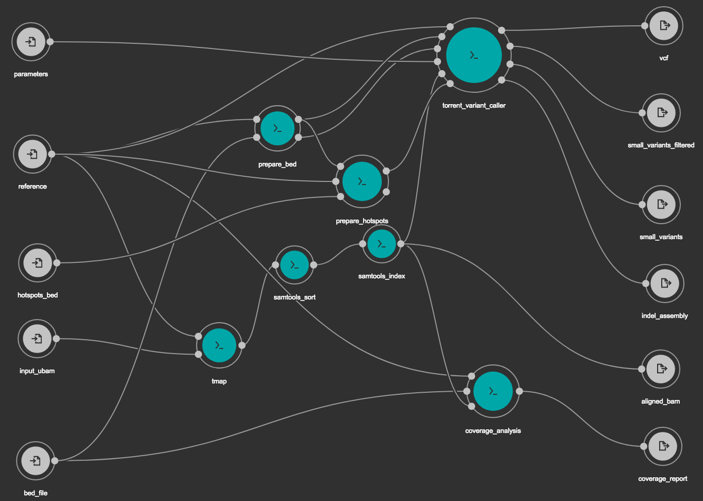

# Somatic - Ion Torrent

Somatic variant calling workflow for the Ion Torrent platforms. There are two workflows
defined in the `workflows` folder, the `torrent-somatic-pipeline-hotspots.cwl` one takes
a "Hotspots" BED file as an additional input.

The files `local_workflow.sh` and `local_workflow_hotspots.sh` are the corresponding scripts
for running the pipeline "locally"..

